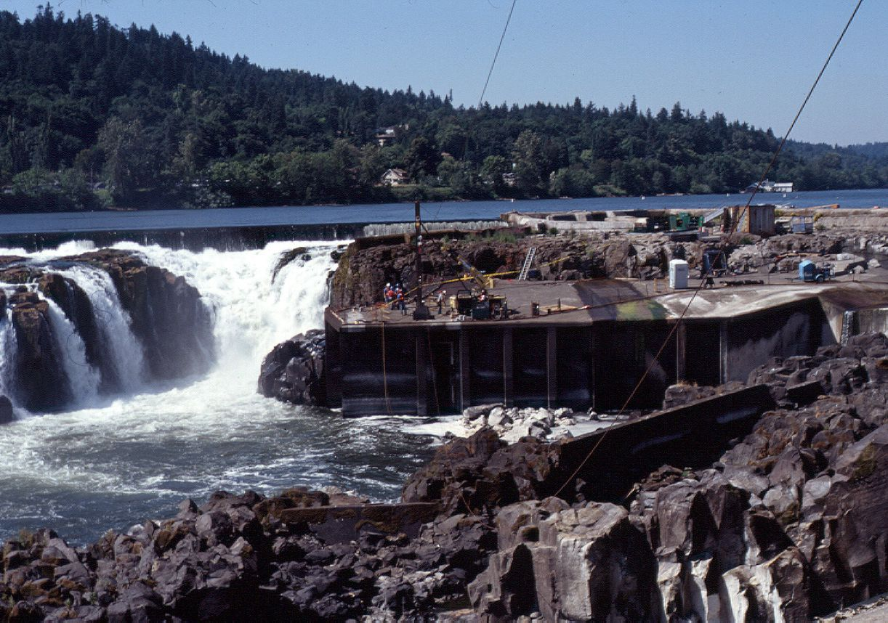

```{r setup, include=FALSE}
knitr::opts_chunk$set(echo = TRUE)
library(tidyverse)
library(here)
library(janitor)
library(tsibble) # time series tibbles
library(feasts)
library(patchwork)
```

### Overview
This report explores adult salmon passage recorded from January 2001 to December 2012 at the Willamette Falls fish ladder on the Willamette River (Oregon). In this report, trends in passages for Coho, Jack Coho, and Steelhead salmon are explored using time series, seasonplots and annual counts. Data were shared by and accessed from Columbia Basin Research DART Adult Passage Graphics & Text | Columbia Basin Research, Columbia Basin Research School of Aquatic & Fishery Sciences University of Washington, www.cbr.washington.edu/dart/query/adult_graph_text, 2021. 


## Looking towards tailspar from yarder at Willamette Falls. 
Source: Forest Engineering Inc., Copyright, 1996


## Map of Willamette Falls. 
Source: Portland District, U.S. Army Corps of Engineers, 2021. 


## Willametter Falls fish passage {.tabset}

```{r, basic data set, warning=FALSE, message=FALSE}
fish <- read_csv(here("data","willamette_fish_passage.csv")) %>% 
  clean_names() %>% 
  select(date,steelhead,coho,jack_coho) %>% 
  mutate(date = lubridate::mdy(date)) %>%     # convert to date type
  rename(jack = jack_coho) %>%                # update column name
  pivot_longer(cols = steelhead:jack,         # convert to tidy data
               names_to="fish_type", 
               values_to = "n_crossing") %>% 
  as_tsibble(key=fish_type, index= date)           # convert date into tsibble
```


### Ttime Series
```{r, tab 1, out.width="100%"}
fish_time <- fish %>% 
  mutate(n_crossing = replace_na(n_crossing, 0)) %>% 
  mutate(Species = (fish_type)) %>% 
  group_by(Species)
  
ggplot(data = fish_time, aes(x = date, y = n_crossing))  +
  geom_line(aes(color = Species)) +
  facet_wrap(~Species) +
  scale_color_hue(labels = c("Coho", "Jack Coho", "Steelhead"))+
  theme_light()+ 
  theme(axis.text.x = element_text(angle = 60, hjust = 1)) +
  labs(title = "Willamette Falls Fish Passages 2001-2010") +
        xlab("Date") +
        ylab("Counts of Adult Salmon Passage") 

```
**Figure 1.** 
Yearly count of Coho, Jack and Steelhead salmon passing through the Willamette Falls fish ladder from 2001 to 2010. 
Graph 1 shows the time series by year of adult coho salmon (*Oncorhynchus mykiss*).
Graphs 2 and 3 show, respectively, the time series passage by year of adult and coho and steelhead salmon (*Oncorhynchus kisutch*).  
Data: Columbia River DART.

**Trends:**

- Adult coho salmon have steadily increasing counts from 2009 onward. 
- There does not seem to be an increase in yearly counts of adult coho and steelhead salmon passing through the Willamette Falls fish ladder from 2001 to 2010. 

### Seasonplots
```{r, tab 2, out.width="100%", warning=FALSE }

basic_seasonplot <- function(fish_data, fish_type_str){
 
  month_fish_plot <- fish_data %>% 
    filter(fish_type == fish_type_str) %>%  
    index_by(yr_mo = ~yearweek(.)) %>% # group by year and month
    summarize(monthly_mean_crossings = mean(n_crossing, na.rm=TRUE))  %>% 
    gg_season(y=monthly_mean_crossings) +
    labs(x=" ",
         y="weekly average passage")+
    theme_light()
  
  return(month_fish_plot)
}

steel_season <- basic_seasonplot(fish, "steelhead")+
  labs(title = "Graph 1. Adult Steelhead  Passage")

coho_season <- basic_seasonplot(fish, "coho") +
  labs(title = "Graph 2. \nAdult Coho Passage")

jack_season <- basic_seasonplot(fish, "jack") +
  labs(title = "Graph 3. \nJack Coho Passage")+
  labs(y="")


steel_season / (coho_season| jack_season) +
  plot_layout(guides = "collect") & theme(legend.position = 'right')
```

**Figure 2.** 
Average weekly count of three groups of salmon passing through the Willamette Falls fish ladder from 2001 to 2010. 
Graph 1 shows the average weekly passage by year of adult Steelhead salmon (*Oncorhynchus mykiss*).
Graphs 2 and 3 show, respectively, the average weekly passage by year of adult and jack Coho salmon (*Oncorhynchus kisutch*).  
Data: Columbia River Dart.

**Trends:**

- We observe that adult Steelhead salmon have clear seasonality of the weekly average passage. 
The  average count increases from December to May/June, then decreases until August/September and remains in less than 100 average crossings until December.

- Both groups of Coho salmon have the same seasonality in weekly average passage. Coho salmon are recorded to use the fish ladder from August to December regardless of life stage, with crossings increasing from August and peaking in September. 

- Average weekly crossings of adult Coho salmon have increased from 2001 to 2010, while passage of adult Steelhead salmon has decreased in the same period. 

### Annual counts by species
```{r, tab 3, out.width="100%" ,fig.cap= "**Figure 3**. Annual count of Steelhead, jack Coho, and coho salmon passing passing through Willamette Falls fish ladder from 2001 to 2010. Steelhead salmon, *Oncorhynchus mykiss*, are shown to have the highest annual counts (blue line).The adult Coho and jack Coho salmon, *Oncorhynchus kisutch*, (red and green line respectively) have lower annual counts than Steelhead, but the adult Coho increase after 2008. Data: Columbia River Dart."}

# Make a subset of the fish dataframe for annual passage counts
fish_annual <- fish %>% 
  index_by(year = ~year(.)) %>% 
  group_by(fish_type) %>% 
  summarize(annual_count = sum(n_crossing, na.rm = TRUE)) # total fish count of each fish_type per year

# Plot the annual counts by year
ggplot(data = fish_annual,aes(x=year,y=annual_count, color=fish_type))+
  geom_line()+
  theme_light()+
  scale_x_continuous(breaks = c(2001:2010))+
  scale_color_hue(labels = c("Coho", "Jack Coho", "Steelhead"))+
  guides(color = guide_legend(reverse = T))+
  labs(x= "Year", y= "Annual count", title = "Annual counts of Coho, jack Coho, and Steelhead salmon", subtitle = "surveyed from 2001-2010")+
  theme(legend.position = c(.80, .80))+
  theme(legend.title = element_blank())
  
```


**Trends:** 

- Steelhead salmon counts are the highest among the three salmon groups observed. Steelhead decrease in 2003 and 2005, but increase in 2004 and again in 2010 after having relatively constant annual counts from 2005-2009. 

- Jack Coho have the lowest counts among the three groups.

- Coho counts are similar to Jack Coho, but counts increase after 2008. 
